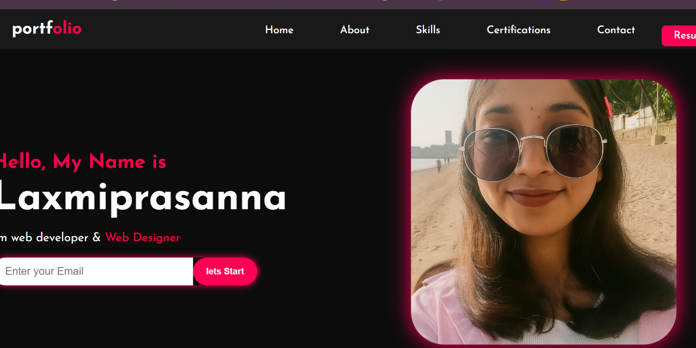

# 💼 My Portfolio Website

This is my personal portfolio website built using **HTML**, **CSS**, and **JavaScript**.  
It showcases my projects, skills, and background — designed to be fully **responsive** on both **laptop** and **mobile** devices.

---

## 🌐 Live Website

🔗 [Click to View Live](https://prasanna-joga.github.io/my-portfolio/)

---

## 📱💻 Responsive Design

| 💻 Laptop View | 📱 Mobile View |
|----------------|----------------|
|  |  |

## 🚀 Sections Included

- **Home**
- **About Me**
- **Skills**
- **Projects**
- **Education**
- **Contact**

---

## 🛠️ Technologies Used

- **HTML5** – Semantic structure
- **CSS3** – Styling and responsive layout using media queries
- **JavaScript** – For interactive features (navbar, animations, etc.)
- **GitHub Pages** – Hosting

---

## 📁 Folder Structure

